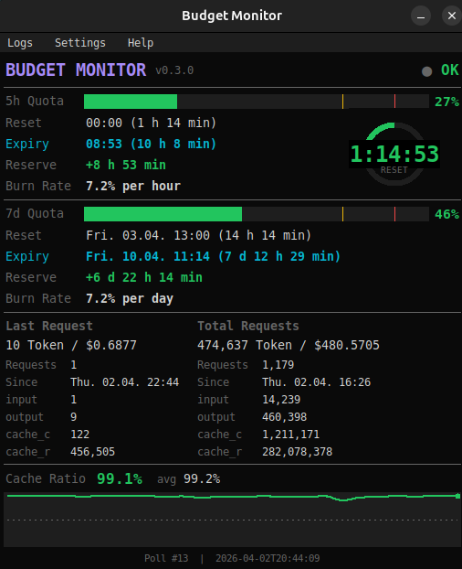

# BudMon — Budget Monitor for Claude Code

Real-time desktop dashboard that monitors your Claude Code token usage,
quota utilization, burn rate, and costs.



## Why BudMon?

Claude Code users on the Max plan have a token budget that resets every 5 hours
and every 7 days. Exceeding the budget means being rate-limited or blocked.
The problem: Claude Code shows no real-time feedback on how fast you are
consuming your budget.

BudMon fills this gap. It captures the rate-limit headers from every API
response and visualizes them as a live dashboard. You can see at a glance:

- How much of your 5h and 7d quota is used
- How fast you are burning through it
- When the quota resets
- Whether you will run out before the reset
- How much you are spending in dollars

BudMon runs as a standalone window alongside Claude Code. It requires no
API keys, no network access, and no external services. All data is read
locally from files that Claude Code writes during operation.

## Features

- **5h / 7d Quota Bars** — progress bars with configurable warning (default 75%) and alarm (default 90%) thresholds
- **Burn Rate** — consumption rate in %/hour (5h) or %/day (7d), color-coded
- **Expiry Estimate** — predicted time when the quota runs out, with date for 7d
- **Reserve** — time difference between predicted expiry and next reset (positive = safe, negative = will run out)
- **Countdown Ring** — circular timer showing either time to reset or time to expiry (whichever comes first)
- **Last Request / Total Requests** — token breakdown per turn and cumulative (input, output, cache create, cache read)
- **Cost Display** — dollar cost per request and cumulative, based on model-specific token prices
- **Cache Ratio Sparkline** — historical graph of cache hit ratio with average
- **Multi-language** — German and English, switchable at runtime, auto-detects system language
- **Model Presets** — Opus, Sonnet, Haiku token prices, or custom
- **Dark Theme** — terminal-inspired dark color scheme, consistent across all UI elements
- **HiDPI / 4K Support** — automatic DPI scaling on Windows, Linux, and macOS
- **Window Position Memory** — remembers its last position, reopens there (with screen bounds check)
- **Configurable** — all thresholds, prices, language, and refresh rate via INI file

## Supported Platforms

| Platform | Status | Notes |
|---|---|---|
| **Linux** (X11) | Full support | Primary development platform. Tested on Ubuntu 24.04. |
| **Linux** (Wayland) | Should work | tkinter runs under XWayland. Screenshot tools may differ. |
| **macOS** | Should work | Retina scaling handled natively by tk. |
| **Windows** | Should work | DPI awareness via ctypes/shcore. Wrapper is `.cmd` instead of shell alias. |

## Requirements

- **Python 3.10+** with tkinter
- **Claude Code** (CLI version, installed via npm)
- **Node.js** (comes with Claude Code)

### Installing tkinter

tkinter is included with most Python installations. If missing:

| OS | Command |
|---|---|
| Ubuntu / Debian | `sudo apt install python3-tk` |
| Fedora | `sudo dnf install python3-tkinter` |
| Arch | `sudo pacman -S tk` |
| macOS (Homebrew) | `brew install python-tk` |
| Windows | Reinstall Python with "tcl/tk" option checked |

## Installation

### From PyPI (recommended)

```bash
pip install budmon
```

### From source

```bash
git clone https://github.com/weilhalt/budmon.git
cd budmon
pip install .
```

### Development install

```bash
git clone https://github.com/weilhalt/budmon.git
cd budmon
pip install -e .
```

## Setup

BudMon needs a small interceptor to capture rate-limit data from Claude Code's
API responses. Run the setup once after installation:

```bash
budmon --setup
```

This does three things:

1. **Installs the interceptor** (`~/.claude/budmon-interceptor.mjs`) — a read-only
   Node.js fetch wrapper that captures response headers and token usage.
   It **never modifies outgoing requests**.

2. **Creates the `claude-budmon` command**:
   - Linux/macOS: shell alias in `.bashrc`/`.zshrc` + wrapper in `~/.local/bin/`
   - Windows: `.cmd` wrapper in a PATH directory

3. **Creates a desktop entry** (Linux only) so BudMon appears in your
   application menu.

### If you already have an interceptor

If you are already using `cache-fix-preload.mjs` or a similar community
interceptor that writes `~/.claude/usage-limits.json`, BudMon will detect
it automatically. No additional setup needed — just run `budmon`.

## Usage

### Step 1: Start Claude Code with the interceptor

```bash
claude-budmon
```

This is identical to running `claude`, but with the interceptor loaded.
Use it exactly as you would use `claude` — all arguments are passed through.

### Step 2: Start the dashboard

In a second terminal (or from your application menu):

```bash
budmon
```

The dashboard opens and starts polling for data every second. On first start
without data, it will offer to run the setup automatically.

### Day-to-day workflow

1. Always start Claude Code via `claude-budmon` instead of `claude`
2. Start `budmon` whenever you want to monitor your budget
3. BudMon runs independently — you can start and stop it at any time

## What each display shows

### Quota Bars (5h and 7d)

Two horizontal progress bars showing your current quota utilization as a
percentage. Threshold markers at the configurable warn and alarm levels.

- **Green** — below warning threshold (default <75%)
- **Yellow** — between warning and alarm (default 75-90%)
- **Red** — above alarm threshold (default >90%)

### Reset

The time when your quota window resets, with a countdown. For 7d, includes
the date (e.g. "Fri. 04.04. 13:00").

### Expiry

Estimated time when your quota will run out at the current burn rate.
Shown in cyan (normal), yellow (warning), or red (alarm).

### Reserve

The difference between expiry and reset. Positive means you have time to spare.
Negative means you will hit the limit before the reset.

- **+2 h 30 min** — safe, 2.5 hours of headroom
- **-45 min** — will run out 45 minutes before reset

### Burn Rate

Your consumption speed. For 5h: percent per hour. For 7d: percent per day.
Displayed in white text.

### Countdown Ring

A circular timer positioned over the 5h quota bar. Shows either:

- **RESET** (green) — counting down to quota reset
- **EXPIRY** (yellow/red) — counting down to quota exhaustion (if earlier than reset)

### Last Request / Total Requests

Two columns showing token breakdown:

- **Requests** — number of API turns
- **Since** — when the session or tracking started
- **input** — input tokens (user messages, system prompts)
- **output** — output tokens (assistant responses)
- **cache_c** — cache creation tokens (first time a prompt is cached)
- **cache_r** — cache read tokens (subsequent uses of cached prompts)
- **Cost** — dollar amount based on model prices

### Cache Ratio Sparkline

A line graph showing the historical cache hit ratio. Higher is better (and cheaper).

- The **current ratio** is shown as a large percentage
- The **average** is shown next to it
- A dashed line marks the 50% threshold
- The dot at the end of the line is color-coded (green/yellow/red)

## CLI Options

```
budmon              Start the dashboard
budmon --setup      Install the Claude Code interceptor
budmon --uninstall  Remove the interceptor and aliases
budmon --version    Show version number
budmon --help       Show usage information
```

## Configuration

All settings are stored in `~/.claude/budmon.ini`. This file is created
automatically on first run with commented defaults. You can edit it:

- Via the dashboard: **Settings > INI**
- Or manually with any text editor

### Config file structure

```ini
[general]
# Language: "auto" (detect from system), "de", "en"
language = auto

# Dashboard refresh interval in milliseconds
refresh_ms = 1000

[model]
# Model determines token prices: opus, sonnet, haiku, custom
model = opus

[prices]
# Only used when model = custom. Uncomment to activate.
# Prices per 1M tokens in USD.
#
# price_input = 15.0
# price_output = 75.0
# price_cache_read = 1.5
# price_cache_create = 18.75

[thresholds]
# Quota warning/alarm (percent)
quota_warn_pct = 75.0
quota_alarm_pct = 90.0

# Cache ratio warning/alarm (0.0 - 1.0)
cache_warn_ratio = 0.50
cache_alarm_ratio = 0.20

# Burn rate safe/warning (percent per hour)
burn_safe_pct_h = 15.0
burn_warn_pct_h = 25.0

[window]
# Window position (managed automatically)
geometry =
```

### Model presets

| Model | Input | Output | Cache Read | Cache Create |
|---|---|---|---|---|
| **Opus** | $15.00 | $75.00 | $1.50 | $18.75 |
| **Sonnet** | $3.00 | $15.00 | $0.30 | $3.75 |
| **Haiku** | $0.80 | $4.00 | $0.08 | $1.00 |

Prices per 1M tokens in USD. Select via Settings > Model or in the INI file.
For custom prices, set `model = custom` and uncomment the values in `[prices]`.

## Menu

### Logs

- **Session Log** — opens the current session's per-turn token log
- **History Log** — opens the persistent history across all sessions
- **Folder** — opens the log directory in the file manager

### Settings

- **Language** — switch between German and English (rebuilds UI)
- **Model** — select Opus, Sonnet, Haiku, or Custom (updates prices immediately)
- **INI** — open the configuration file in the system text editor

### Help

- **User Guide** — opens the built-in help file (in the current language)
- **About** — version, author, license, homepage, runtime info

## How it works

BudMon consists of two independent parts:

### 1. Interceptor (`budmon-interceptor.mjs`)

A Node.js module loaded via `NODE_OPTIONS="--import ..."` when starting
Claude Code. It hooks into the global `fetch()` function and:

- **Captures rate-limit headers** from every `/v1/messages` API response
  (e.g. `anthropic-ratelimit-unified-5h-utilization`)
- **Extracts token usage** from SSE stream events (`message_start`,
  `message_delta`)
- **Writes everything to local JSON files** — never sends data anywhere

The interceptor is strictly **read-only**: it passes all requests and
responses through unmodified. It only reads from the response stream.

### 2. Dashboard (`budmon`)

A Python/tkinter desktop application that:

- Polls `~/.claude/usage-limits.json` every second (configurable)
- Parses quota percentages, reset times, and token counts
- Calculates burn rate, expiry time, and reserve
- Renders all data as a dark-themed GUI with progress bars, sparklines,
  and a countdown ring

### Data files

All data is stored in `~/.claude/`:

| File | Written by | Content |
|---|---|---|
| `usage-limits.json` | Interceptor | Current quota, headers, per-turn and cumulative tokens |
| `usage-cumulative.json` | Interceptor | Cumulative token totals (survives session restarts) |
| `usage-session.jsonl` | Interceptor | Per-turn log for the current session |
| `usage-history.jsonl` | Interceptor | Persistent per-turn log across all sessions |
| `budmon.ini` | BudMon | Configuration |

## Privacy

BudMon captures **only technical metadata** from Claude Code API responses:

- Rate-limit headers (quota percentages, reset timestamps)
- Token counts (input, output, cache read, cache create)
- Timestamps of API calls

BudMon **does not** capture:

- Message content (prompts, responses, tool calls)
- API keys or authentication tokens
- Personal information
- File contents or code

All data stays local in `~/.claude/`. BudMon has **no network access** —
it never connects to any server, sends no telemetry, no analytics, no crash
reports. The interceptor operates entirely within the Claude Code Node.js
process and writes only to local files.

The interceptor source code is included in the package
(`budmon/interceptor.mjs`) and can be audited at any time.

## Security

The interceptor is a **read-only** passthrough. It hooks into `globalThis.fetch`
to read response headers and SSE stream data, but:

- It **never modifies outgoing requests** (no payload changes, no header injection)
- It **never blocks or delays** requests or responses
- It **fails open** — any error in the interceptor is silently caught, ensuring
  Claude Code continues to work normally

The interceptor is loaded via Node.js `NODE_OPTIONS="--import ..."`, a standard
mechanism. It only runs when you explicitly start Claude Code via `claude-budmon`.

## Compatibility

BudMon reads rate-limit headers from the Anthropic API, which follow a stable
documented format (`anthropic-ratelimit-unified-*`). Token usage is extracted
from the standard SSE streaming format (`message_start`, `message_delta`).

**When Claude Code updates:**
The interceptor should continue to work as long as Anthropic does not change
their API response format. If something breaks after an update:

1. Check if `~/.claude/usage-limits.json` is still being written
2. Try `budmon --uninstall` followed by `budmon --setup` to reinstall
3. File an issue at the project repository

**When Anthropic changes quota windows:**
The 5h and 7d windows are read from the API headers, not hardcoded.
If Anthropic changes the window sizes, BudMon will adapt automatically.

## Troubleshooting

**Status "WAIT", all values "--", footer shows "Waiting for data..."**

This is the normal startup state. BudMon is waiting for Claude Code to
deliver data. This is not an error if BudMon was started before Claude Code.

If the state persists after Claude Code is running:

1. **Was `budmon --setup` run?**
   Check: does `~/.claude/budmon-interceptor.mjs` exist?
   If not: run `budmon --setup`.

2. **Was Claude Code started via `claude-budmon`?**
   Only `claude-budmon` loads the interceptor. A plain `claude`
   does not write data for BudMon.

3. **Was at least one message sent?**
   The interceptor writes on the first API response.
   Before the first turn, the data file does not exist yet.

4. **Does the data file exist?**
   Check: `ls -la ~/.claude/usage-limits.json`
   If it exists but is old: Claude Code was likely started without
   the interceptor. Restart via `claude-budmon`.

5. **Had data before but not anymore?**
   The Claude Code session was ended. Start a new session
   via `claude-budmon`.

**Dashboard shows quota bars but token details are "--"**

This is normal for a brief moment. Rate-limit headers are written immediately
when the API responds, but token counts are written after the streaming
response completes. There is a short window where quota bars work but
token details have not arrived yet.

If it persists: Claude Code must have been started via `claude-budmon`.
A regular `claude` session does not load the interceptor.

**Burn rate / expiry / reserve show "--"**

Burn rate requires two things:
- The quota percentage must be above ~0.01% (no calculation if nothing was consumed)
- The reset timestamp must be present in the API headers

If reset is shown but burn rate is not: the quota utilization is too low
to calculate a meaningful rate. This resolves itself after more usage.

**Window opens at wrong position**

- Delete the `geometry` line in `~/.claude/budmon.ini` to reset to center
- Or edit it via Settings > INI

**Setup says "Compatible interceptor found"**

- You already have a working interceptor (e.g. `cache-fix-preload.mjs`)
- No additional setup needed — just run `budmon`

## Uninstall

```bash
budmon --uninstall
pip uninstall budmon
```

`budmon --uninstall` removes:
- `~/.claude/budmon-interceptor.mjs`
- The `claude-budmon` alias from `.bashrc`/`.zshrc`
- The wrapper script in `~/.local/bin/`
- The `.desktop` file (Linux)

Data files in `~/.claude/` are **not** removed.

## Project structure

```
budmon/
  __init__.py         Package + version
  __main__.py         Entry point for python -m budmon
  cli.py              CLI argument handling (--setup, --version, etc.)
  config.py           INI-based configuration singleton
  dashboard.py        Main tkinter GUI class
  data.py             Data loading, calculations, formatting
  i18n.py             Internationalization (JSON language files)
  interceptor.mjs     Node.js fetch interceptor (installed by --setup)
  models.py           Constants, dataclasses, color functions
  platform.py         HiDPI detection, file viewer
  setup.py            Setup/uninstall logic
  widgets.py          Canvas drawing, UI builder functions
  budmon.default.ini  Default configuration template
  lang/
    de.json           German strings
    en.json           English strings
  help/
    help_de.md        German user guide
    help_en.md        English user guide
  icons/
    budmon.svg        Application icon (Lucide "activity", MIT)
    budmon-*.png      Pre-rendered icon sizes (16-256px)
```

## Contributing

Contributions are welcome. Please:

1. Fork the repository
2. Create a feature branch
3. Run `pytest` before submitting
4. Open a pull request with a clear description

Code style: Python 3.10+, type hints, no external dependencies (stdlib only).

## Credits

- Icon: [Lucide](https://lucide.dev/) "activity" icon (MIT License — compatible with GPL-3.0, included with permission)
- Interceptor approach inspired by community work on
  [claude-code#42052](https://github.com/anthropics/claude-code/issues/42052)

## License

GPL-3.0 — see [LICENSE](LICENSE)

Copyright (c) 2026 weilhalt
